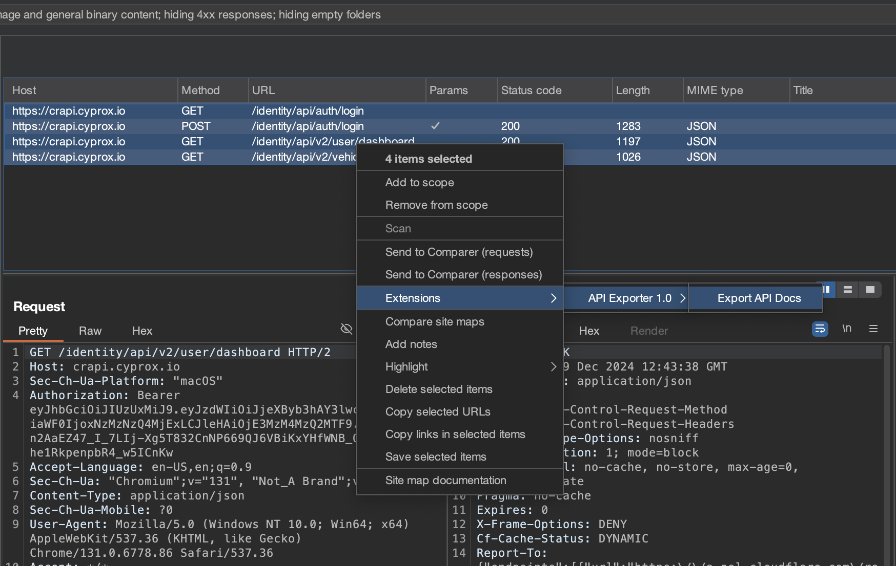
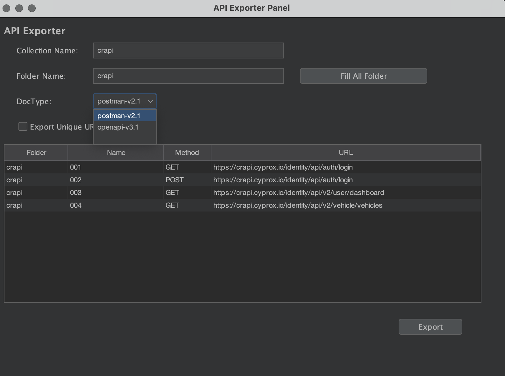

# Burp Suite Extension - API Exporter
## Overview
API Exporter is a Burp Suite extension designed to dynamically generate API documentation in both OpenAPI 3.1 and Postman 2.1 formats. It extracts request and response details from intercepted HTTP traffic, processes the data, and generates structured API documentation files that comply with industry standards.

## Features

* OpenAPI 3.1 Support: Automatically generates OpenAPI-compliant 
* Postman 2.1 Support: Exports API documentation compatible with 
* Dynamic Content Type Handling: Supports application/json, application/xml, and other media 
* Request Body Parsing: Dynamically processes body content for different content types.
* Extensible: Easily integrates into penetration testing workflows.


## Installation
Requirements

* Burp Suite (Community or Professional Edition)
* Java (JDK 11 or later)

### Build Steps

1. Clone or download this repository.
2. Build the extension using your favorite IDE or a build tool (e.g., gradle or maven).
3. Open Burp Suite, go to Extensions > Add.
4. Load the compiled .jar file.

### Use JAR File 
1. Download [JAR](https://github.com/cyproxio/burp-api-exporter/blob/main/out/artifacts/api_parser_jar/api-parser.jar) file 
2. Open Burp Suite, go to Extensions > Add.
3. Load the compiled .jar file.

## Usage 
1.	Intercept Requests: Use Burp Suite’s proxy to intercept HTTP requests.
2.	Generate API Documentation: The extension will automatically process intercepted traffic to create API documentation.
3.	Export Documentation: Choose between OpenAPI 3.1 or Postman 2.1 format for export.

## Examples

#### OpenAPI 3.1 Output Example
```json
{
  "openapi": "3.1.0",
  "info": {
    "title": "Generated API Documentation",
    "version": "1.0.0"
  },
  "paths": {
    "/example/path": {
      "post": {
        "requestBody": {
          "content": {
            "application/json": {
              "example": {
                "key": "value"
              }
            }
          }
        },
        "responses": {
          "200": {
            "description": "Successful response"
          }
        }
      }
    }
  }
}
```
#### Postman 2.1 Output Example
```json
{
  "info": {
    "name": "Generated API Documentation",
    "schema": "https://schema.getpostman.com/json/collection/v2.1.0/collection.json"
  },
  "item": [
    {
      "name": "Example API",
      "request": {
        "method": "POST",
        "url": "/example/path",
        "body": {
          "mode": "raw",
          "raw": "{ \"key\": \"value\" }"
        }
      },
      "response": []
    }
  ]
}
```

## Screenshots
Here are some screenshots showcasing the extension’s functionality:




## Acknowledgments

We would like to express our gratitude to the [Postman Integration extension](https://github.com/portswigger/postman-integration) for providing valuable insights and inspiration during the development of this project.
